# Themes

Revealer ships built-in themes and can also use any stock reveal.js theme.

| Theme | Description |
| --- | --- |
| `revealer` | **Default.** A neutral, sober look: grey/black headings with a discreet blue accent. Intended to be presentation-agnostic and easy to reuse. |
| `ljp` | **Laboratoire Jean Perrin** branding: dark-teal headings, blue sub-headings and matching links. |
| `sfi` | A bold blue accent look with full-bleed section dividers. |
| any reveal.js theme | `black`, `white`, `league`, … (see the [reveal.js themes](https://revealjs.com/themes/)). |

Select a theme in the settings part of a `.pres` file:

```
> theme: ljp
```

You can also switch theme for a single slide:

```html
=== Interlude
> theme: black

This slide uses the `black` theme; the next slide returns to the presentation
theme automatically.
```

This swaps the theme stylesheet while the slide is active, so it works best for
complete reveal.js themes (`black`, `white`, `league`, `ljp`, `revealer`, ...).
The switch is local to the current slide: navigating away restores the global
theme selected in the settings block.

## Gallery

The same slide rendered by every theme. Browse it live with
`revealer Demo/Themes.pres`; the screenshots below are regenerated
by `python3 Documentation/gen_theme_gallery.py` after a
`revealer build Demo/Themes.pres`.

**`revealer`**

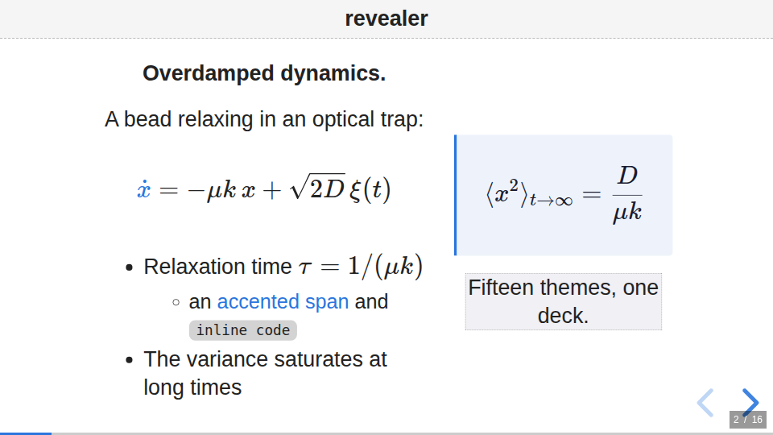

**`ljp`**

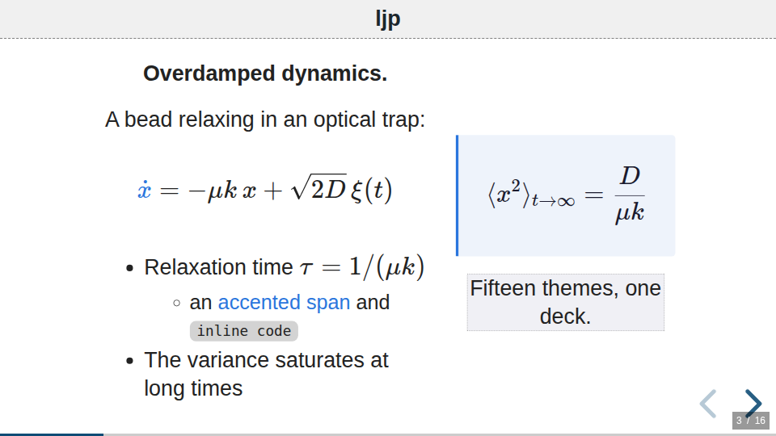

**`sfi`**

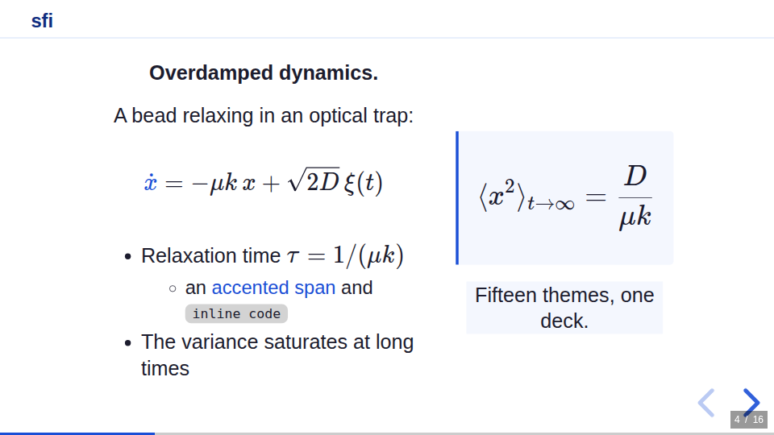

**`black`**

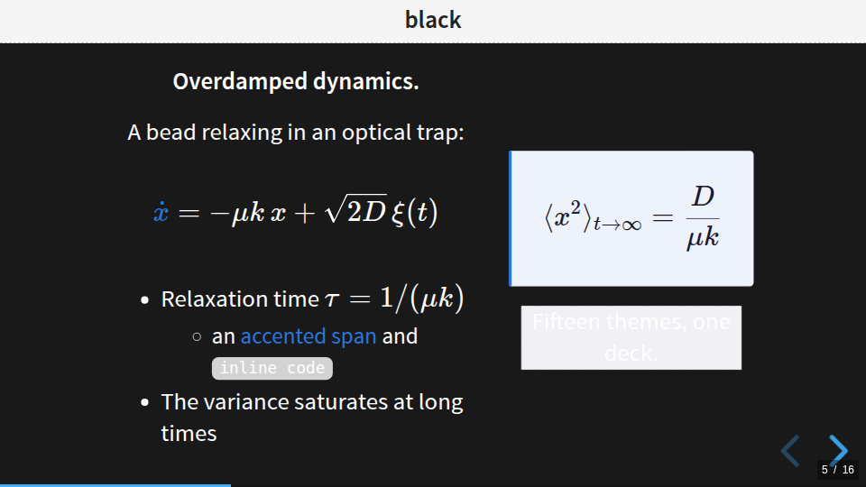

**`white`**

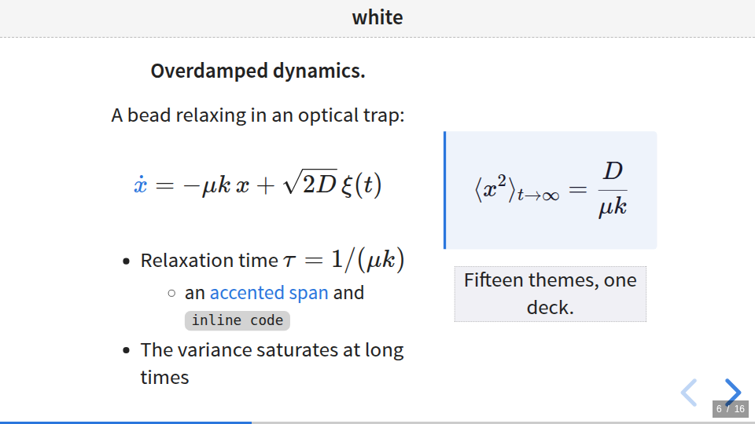

**`league`**

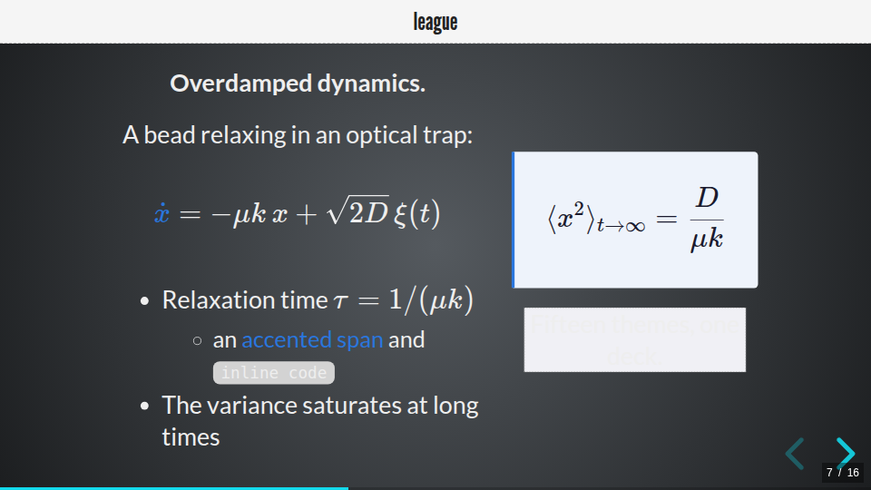

**`beige`**

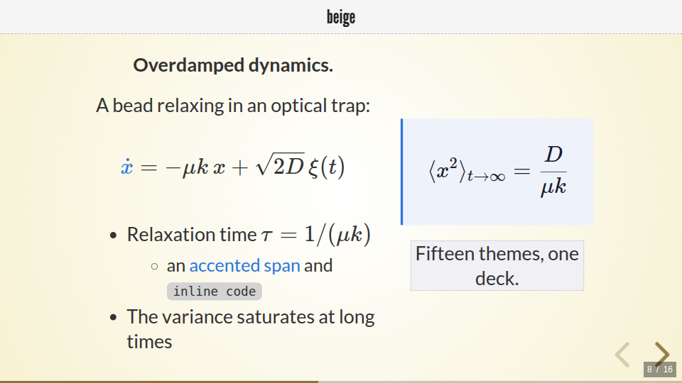

**`night`**

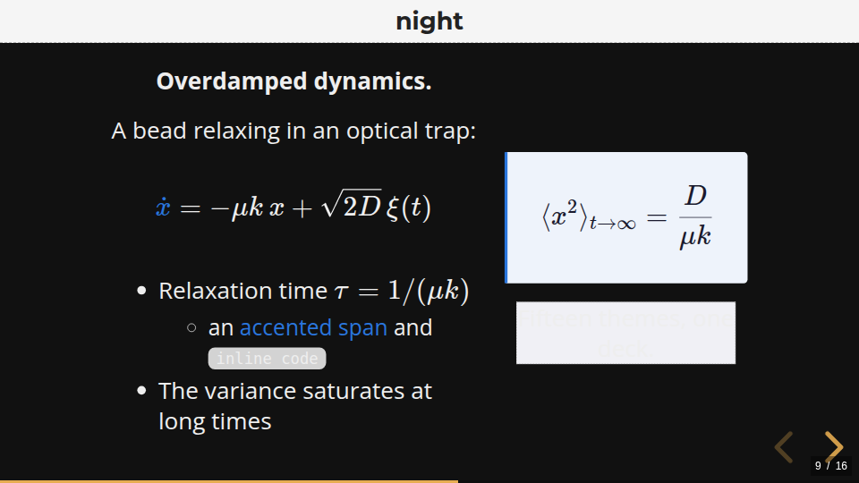

**`serif`**

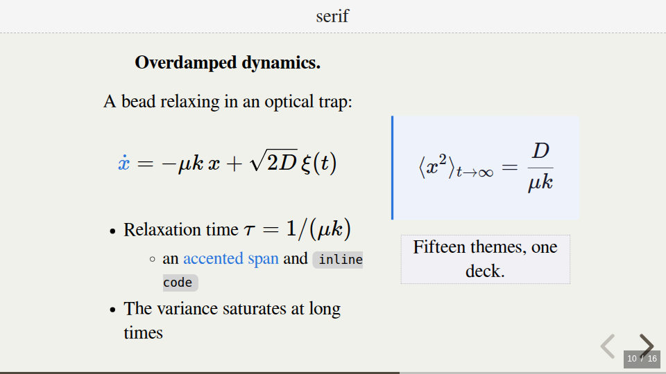

**`simple`**

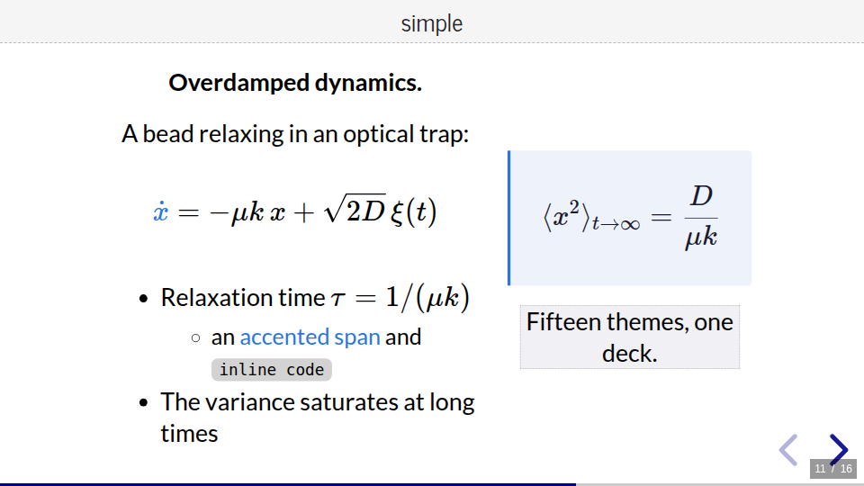

**`solarized`**

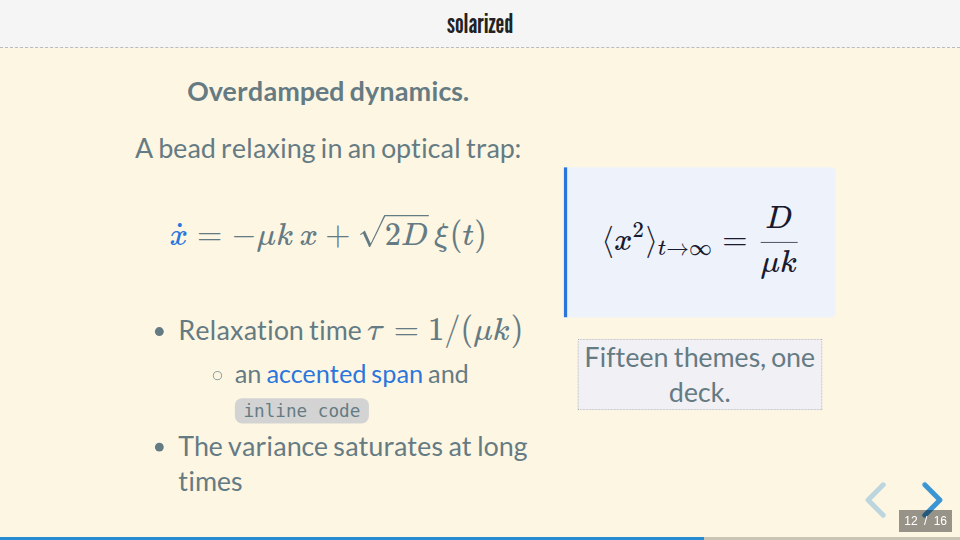

**`blood`**

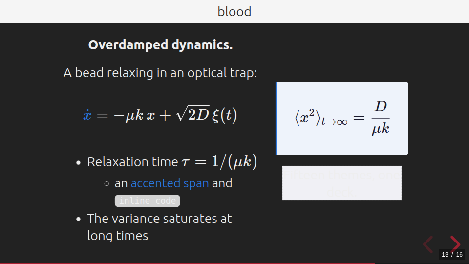

**`moon`**

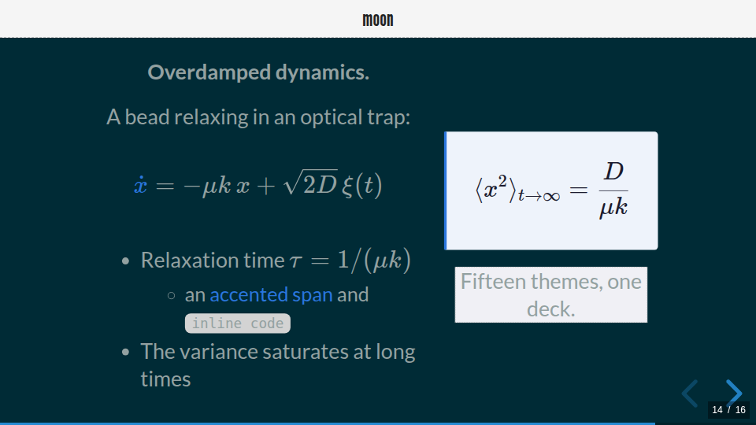

**`sky`**

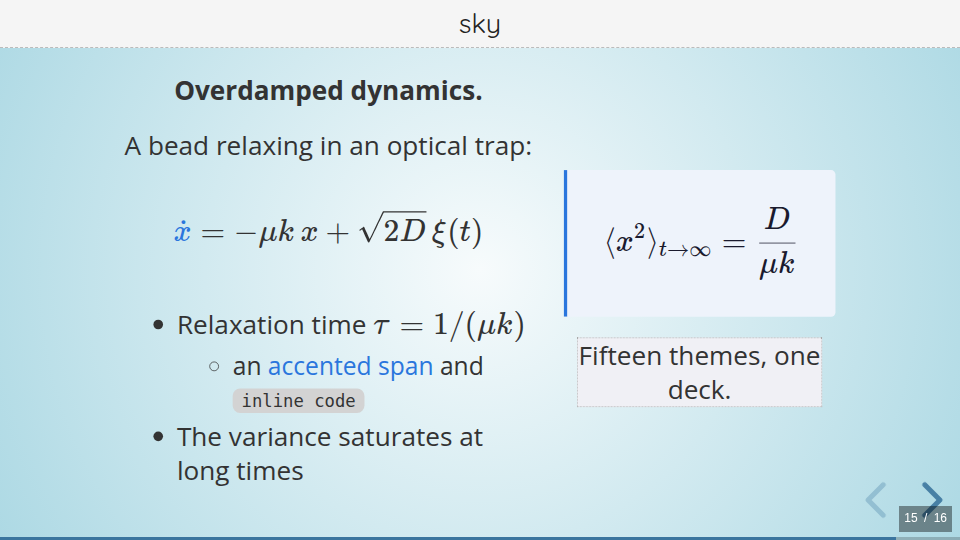

**`dracula`**

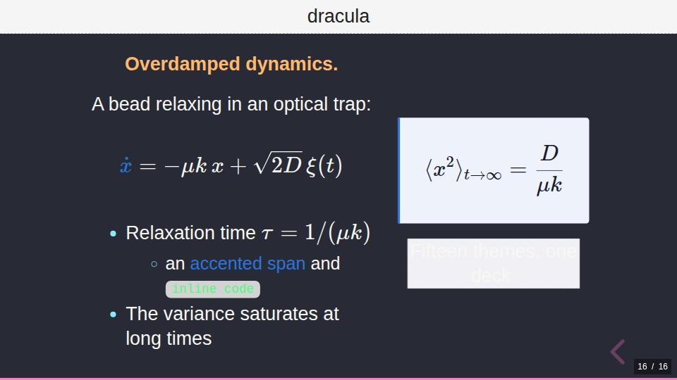
## Customising

The built-in themes are intentionally thin. They `@import` a shared, theme-agnostic
base stylesheet (`_revealer-base.css`) and then override a handful of CSS custom
properties. To create your own theme, copy `revealer.css`, rename it, and tweak the
variables:

```css
@import url(_revealer-base.css);

:root {
  --rv-h1-color: #1a1a1a;       /* main heading colour */
  --rv-h2-color: #555;          /* sub-heading colour */
  --rv-header-bg: #f5f5f5;      /* fixed header / logo bar background */
  --rv-header-color: #222;      /* fixed header text colour */
  --r-link-color: #2a76dd;      /* links and accents */
  --rv-highlight-bg: #f0f0f5;   /* highlighted blocks */
}
```

The theme files live in `src/revealer/data/themes/` and are copied into each
presentation's `reveal.js/dist/theme/` folder at build time. Logos remain a
per-presentation choice (`> logo:` in the `.pres` file) and are independent of
the theme.

The components emitted by the layout DSL (callout boxes, cards, stacks,
pins, equation frames — the `rv-*` and `box-*` classes listed in the
[constructs reference](reference/constructs.md)) are styled by the shared
base stylesheet, so they look consistent under every theme and can be
re-skinned from a custom theme's CSS.

The header and footer band heights are not theme variables: they follow the
theme's default look, and can be overridden per presentation with
`> header-height:` / `> footer-height:` (a fraction of the slide height). See
[Layout parameters](authoring.md#layout-parameters).

## Matplotlib styles

Every theme also ships a palette-matched matplotlib style, copied into each
deck at `reveal.js/dist/theme/<theme>.mplstyle` — use it from your figure
scripts so plots inherit the deck's colors and slide-ready font sizes. See
[Recipes › Plots that match the theme](recipes.md#plots-that-match-the-theme).
